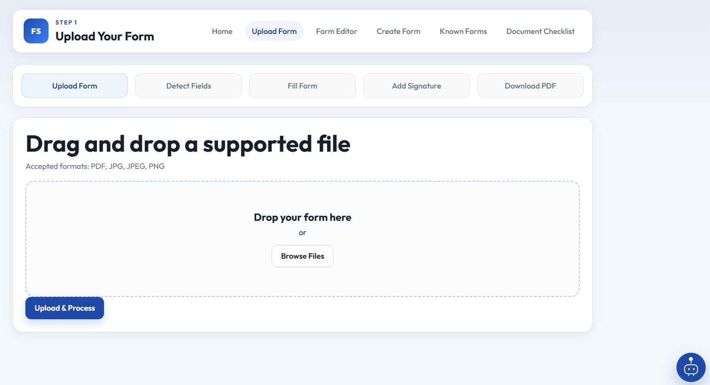
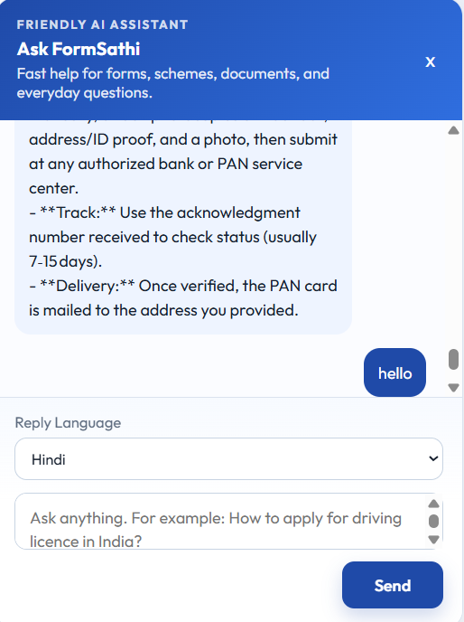
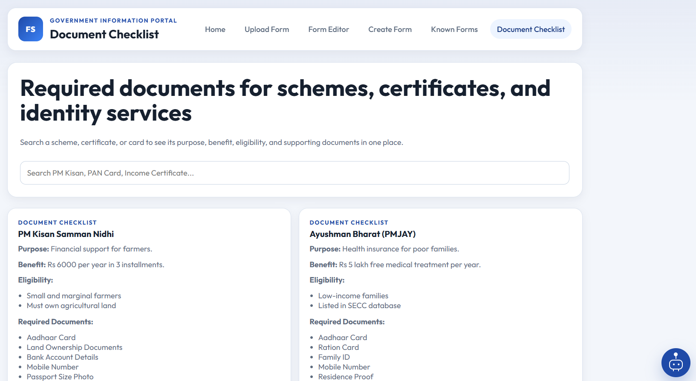
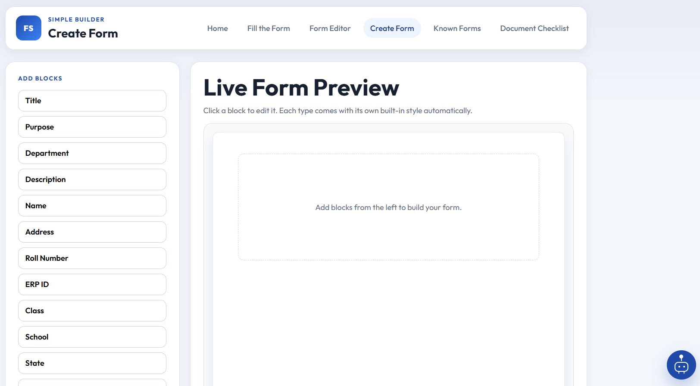
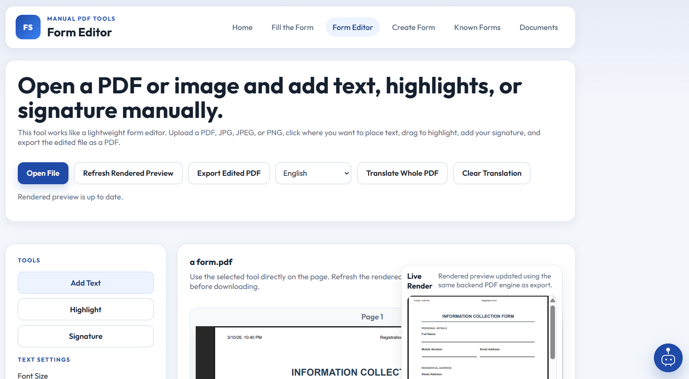

# 🚀 FormSathi – AI-Powered Form & Document Automation with Chatbot & Multilingual Support


---

## 🧠 Overview

**FormSathi** is an AI-powered document intelligence platform that simplifies how users interact with complex forms and documents.

It combines **OCR, LLM-based field detection, multilingual AI, and chatbot interaction** to transform traditional form filling into a **simple, guided, and error-free experience**.

---

## ⚡ Problem

Millions of users face:

* ❌ Form rejection due to incorrect or incomplete data
* 🌐 Language barriers (English / complex forms)
* 💸 Dependency on agents and extra costs
* 📄 Lack of document awareness
* ⏳ Time-consuming manual processes

---

## 💡 Solution

FormSathi provides:

* 🤖 AI-based **form understanding**
* 🧾 Automatic **field detection & filling**
* 🌐 **Multilingual translation**
* 💬 **Chatbot-based guidance**
* ✍️ Digital signature support
* 📄 PDF generation & editing
* 📋 Document checklist & guidance

---

## ✨ Key Features

* 📤 Upload Forms (PDF, JPG, PNG)
* 🔍 OCR Text Extraction (Tesseract)
* 🤖 AI Field Detection (LLM-based)
* 🧾 Dynamic Form Filling
* 🌐 Multilingual Support (EN, HI, BN, TA, MR)
* ✍️ Digital Signature
* 📄 PDF Generation
* 🧩 Known Form Templates
* 🛠️ Form Builder (Custom Templates)
* 📝 PDF Editor + Translation
* 💬 AI Chatbot Assistant
* 📋 Document Checklist

---

## 🏗️ System Architecture

```
User → Upload Form → OCR → AI Field Detection → Dynamic Form → User Input → Signature → PDF Generation → Download
```

---

## 📸 Screenshots

### 🏠 Home Page


### 📤 Upload & Processing



### 🤖 AI Chatbot



### 📄 Document Handling



### 🛠️ Form Builder



### 📝 Form Editor



---

## 🎬 Demo

🔗 **Live Demo:**
👉 (Add your deployed link here)

🎥 **Demo Video:**
👉 (Add your video link here)

---

## 🧠 Tech Stack

### Frontend

* React / Streamlit
* HTML, CSS, JavaScript

### Backend

* FastAPI / Flask
* Python

### AI / ML

* Tesseract OCR
* LLM (Groq API / OpenAI)
* NLP-based Field Detection

### Tools

* OpenCV
* PyPDF / ReportLab
* pdf2image

---

## 🔌 API Endpoints

| Endpoint  | Method | Description         |
| --------- | ------ | ------------------- |
| /upload   | POST   | Upload form         |
| /ocr      | POST   | Extract text        |
| /detect   | POST   | Detect fields       |
| /generate | POST   | Generate filled PDF |

---

## 📁 Project Structure

```
FormSathi/
│── frontend/
│── backend/
│── assets/
│── README.md
```

---

## ⚠️ Challenges

* OCR accuracy on low-quality images
* Handling multiple form formats
* AI field detection consistency
* Multilingual understanding

---

## 📈 Impact

* ✅ Reduced form filling errors
* ⚡ Faster processing
* 💰 Reduced dependency on agents
* 🌍 Improved accessibility

---

## 🚀 Future Scope

* 🎤 Voice-based form filling
* 📱 Mobile application
* ✍️ Handwritten OCR
* 🔐 Secure document storage
* 🤖 AI-based error correction

---

## 🤝 Contribution

Contributions are welcome!
Fork → Improve → Pull Request 🚀

---

## 👨‍💻 Author

**Abhinav**
AI & Data Science Enthusiast

---

## ⭐ Support

If you like this project, please ⭐ star the repository!
