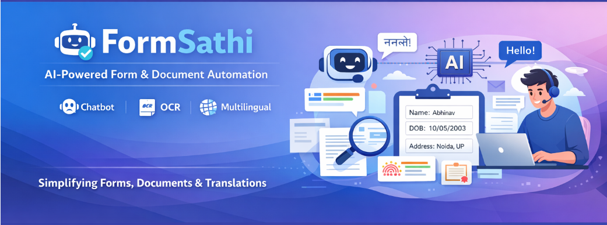

<div align="center">



# 🚀 FormSathi

### AI-Powered Form & Document Automation Platform

**OCR · LLM Field Detection · Multilingual AI · Chatbot Guidance · PDF Generation**

<br/>

[](https://drive.google.com/file/d/155ROcRKoQuK2Q6tNJxY6N4gI0gwpt_ze/view?usp=sharing)
[](https://python.org)
[](https://fastapi.tiangolo.com)
[](LICENSE)

<br/>

> *"Filling a government form shouldn't require an agent, a translator, and a law degree."*

</div>

---

## 📌 The Problem

Every year, **millions of form submissions are rejected** due to errors — costing people time, money, and access to critical services.

| Pain Point | Impact |
|------------|--------|
| ❌ Incorrect / incomplete data | Form rejection, resubmission delays |
| 🌐 Language barriers | Inaccessible for non-English speakers |
| 💸 Agent dependency | Extra costs for basic form assistance |
| 📄 Document unawareness | Users don't know what docs are needed |
| ⏳ Manual processing | Hours spent on simple paperwork |

---

## 💡 The Solution — FormSathi

FormSathi is an **end-to-end AI document intelligence platform** that transforms complex form filling into a simple, guided, error-free experience.

```
Upload Any Form  →  AI Reads It  →  Guides You  →  Fills It  →  Generates PDF
```

No agents. No confusion. No rejections.

---

## ✨ Features

<table>
<tr>
<td width="50%">

### 📄 Document Intelligence
- 📤 Upload Forms (PDF, JPG, PNG)
- 🔍 OCR Text Extraction (Tesseract)
- 🤖 AI Field Detection (LLM-based)
- 🧩 Known Form Templates
- 📋 Document Checklist & Guidance

</td>
<td width="50%">

### 🤖 AI Assistance
- 💬 AI Chatbot Assistant
- 🌐 Multilingual Support (EN, HI, BN, TA, MR)
- 🧾 Dynamic Form Auto-filling
- 📝 PDF Editor + Translation
- 🛠️ Custom Form Builder

</td>
</tr>
<tr>
<td width="50%">

### ✍️ Output & Export
- ✍️ Digital Signature Support
- 📄 Filled PDF Generation
- 📥 One-click Download

</td>
<td width="50%">

### 🔐 Reliability
- ⚡ Fast Processing Pipeline
- 🌍 5 Indian Language Support
- 🧠 Hallucination-controlled AI

</td>
</tr>
</table>

---

## 🏗️ System Architecture

```
┌─────────────────────────────────────────────────────────┐
│                        USER                             │
└─────────────────────┬───────────────────────────────────┘
                      │ Upload PDF / Image
                      ▼
┌─────────────────────────────────────────────────────────┐
│              OCR ENGINE (Tesseract + OpenCV)            │
│         Extracts raw text from any document format      │
└─────────────────────┬───────────────────────────────────┘
                      │ Raw Text
                      ▼
┌─────────────────────────────────────────────────────────┐
│           AI FIELD DETECTION (LLM — Groq API)          │
│     Identifies form fields, labels, required inputs     │
└──────────────┬──────────────────────────┬───────────────┘
               │                          │
               ▼                          ▼
┌──────────────────────┐    ┌─────────────────────────────┐
│   DYNAMIC FORM UI    │    │     AI CHATBOT ASSISTANT    │
│  Auto-filled fields  │    │  Guides user in 5 languages │
└──────────┬───────────┘    └─────────────────────────────┘
           │ User Input + Signature
           ▼
┌─────────────────────────────────────────────────────────┐
│           PDF GENERATION (ReportLab / PyPDF)           │
│         Filled, signed, ready-to-submit document        │
└─────────────────────┬───────────────────────────────────┘
                      │
                      ▼
                 📥 DOWNLOAD
```

---

## 📸 Screenshots

<table>
<tr>
<td align="center" width="50%">

### 🏠 Home Page


</td>
<td align="center" width="50%">

### 📤 Upload & Processing


</td>
</tr>
<tr>
<td align="center" width="50%">

### 🤖 AI Chatbot


</td>
<td align="center" width="50%">

### 📄 Document Handling


</td>
</tr>
<tr>
<td align="center" width="50%">

### 🛠️ Form Builder


</td>
<td align="center" width="50%">

### 📝 Form Editor


</td>
</tr>
</table>

---

## 🧠 Tech Stack

### Frontend


### Backend


### AI / ML


### Document Tools


---

## 🔌 API Reference

| Endpoint | Method | Description | Request |
|----------|--------|-------------|---------|
| `/upload` | `POST` | Upload form file | `multipart/form-data` |
| `/ocr` | `POST` | Extract text from document | `file_id` |
| `/detect` | `POST` | AI field detection | `ocr_text` |
| `/generate` | `POST` | Generate filled PDF | `fields + signature` |
| `/translate` | `POST` | Translate form content | `text + target_lang` |
| `/chat` | `POST` | AI chatbot query | `message + context` |

---

## 📁 Project Structure

```
FormSathi/
│
├── frontend/
│
├── backend/
│   ├── main.py              # FastAPI entry point
│   ├── ocr.py               # Tesseract OCR pipeline
│   ├── field_detection.py   # LLM field detection
│   ├── pdf_generator.py     # PDF generation
│   ├── chatbot.py           # AI chatbot logic
│   └── translator.py        # Multilingual support
│
├── assets/
│   ├── Banner.png
│   ├── home.png
│   ├── upload_form.png
│   ├── chatbot.png
│   └── ...
│
├── .env                     # API keys (not committed)
├── .gitignore
├── requirements.txt
└── README.md
```

---

## ⚙️ Installation & Setup

### 1️⃣ Clone the Repository

```bash
git clone https://github.com/abhichiku18/FormSathi.git
cd FormSathi
```

### 2️⃣ Setup Backend

```bash
cd backend
pip install -r requirements.txt
```

### 3️⃣ Configure Environment

Create a `.env` file in `/backend`:

```env
GROQ_API_KEY=your_groq_api_key_here
```

> Get your free key at [console.groq.com](https://console.groq.com)

### 4️⃣ Run Backend

```bash
uvicorn main:app --reload
```

### 5️⃣ Run Frontend

```bash
cd frontend
npm install
npm start
```

---

## 🌐 Supported Languages

| Language | Code | Status |
|----------|------|--------|
| English | `EN` | ✅ Active |
| Hindi | `HI` | ✅ Active |
| Bengali | `BN` | ✅ Active |
| Tamil | `TA` | ✅ Active |
| Marathi | `MR` | ✅ Active |

---

## 🚧 Challenges & Solutions

| Challenge | Solution |
|-----------|----------|
| OCR accuracy on low-quality scanned images | Preprocessed with OpenCV (denoise, threshold, deskew) |
| Inconsistent AI field detection across form types | Few-shot prompting + structured JSON output from LLM |
| Multilingual form understanding | Language detection + language-specific prompt templates |
| Handling diverse PDF formats | pdf2image conversion before OCR for consistent processing |
| Signature integration into generated PDF | Embedded as base64 image layer using ReportLab |

---

## 📈 Impact

| Metric | Result |
|--------|--------|
| ✅ Form errors | Significantly reduced via AI validation |
| ⚡ Processing time | Minutes vs hours manually |
| 💰 Agent cost | Eliminated for standard forms |
| 🌍 Accessibility | 5 Indian languages supported |
| 👥 Target users | Rural citizens, students, small businesses |

---

## 🎯 Future Scope

- 🎤 **Voice-based form filling** — speak answers in your language
- 📱 **Mobile application** — Android & iOS support
- ✍️ **Handwritten OCR** — process handwritten documents
- 🔐 **Secure document storage** — encrypted cloud vault
- 🤖 **AI error correction** — auto-fix before submission
- 🏛️ **Government API integration** — direct form submission

---

## 🧠 One-Line Summary (For Resume / Interview)

> *"Built an end-to-end AI document automation platform using OCR, LLM-based field detection, and multilingual NLP that guides users through complex form filling in 5 Indian languages and generates submission-ready PDFs."*

---

## 🧠 Skills Demonstrated

| Skill | Detail |
|-------|--------|
| **Computer Vision** | OCR pipeline with Tesseract + OpenCV preprocessing |
| **LLM Integration** | Groq API for intelligent field detection |
| **Full-Stack Development** | React frontend + FastAPI backend |
| **NLP** | Multilingual translation and chatbot |
| **PDF Engineering** | Generation, editing, and signing with ReportLab |
| **Prompt Engineering** | Structured output prompts for consistent AI responses |

---

## 🤝 Contributing

Contributions are welcome! Here's how:

```bash
# 1. Fork the repo
# 2. Create your feature branch
git checkout -b feature/AmazingFeature

# 3. Commit your changes
git commit -m "Add AmazingFeature"

# 4. Push to the branch
git push origin feature/AmazingFeature

# 5. Open a Pull Request
```

---

## 👨‍💻 Author

**Abhinav Chaudhary**
*AI & Data Science Enthusiast*

[](https://github.com/abhichiku18)

---

<div align="center">

### ⭐ If FormSathi helped you, please star the repository!

*Made with ❤️ to make document filling accessible for everyone*

</div>
